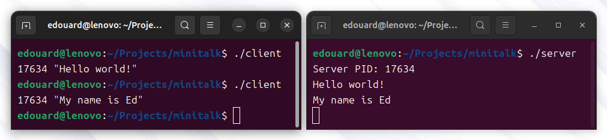
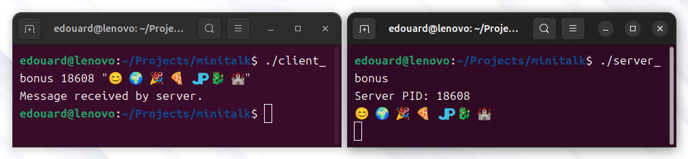

# minitalk

**The purpose of this project is to code a small data exchange program
using UNIX signals.**

- **Subject:** [English](subject/en.subject.pdf) / [French](subject/fr.subject.pdf) / [Spanish](subject/es.subject.pdf)
- **Location:** 42 School Barcelona
- **Validation:** January 2025

## Mandatory part



1. **Clone the Repository**

	```
	git clone https://github.com/leogaudin/minitalk.git
	```
2. **Compile the Code**

	Navigate to the project directory and compile using:
	```
	make
	```

3. **Run the Server**

	Start the server in one terminal:
	```
	./server
	```
	The server will display its process ID (PID). Example: `Server PID: 12345`

4. **Run the Client**

	In another terminal, execute the client with the server's PID and your desired message:
	```
	./client <server_PID> <message>
	```

	For example:
	```
	./client 12345 "Hello"
	```

5. **Message Reception**

	The server will receive and print each character of the message as it is transmitted.

## Bonus part



The bonus part of this project adds the following features:
- The server sends a confirmation signal to the client once the message has been fully displayed on the server.
- Both server and client handle unicode characters.

1. **Compile the code for bonus**
	```
	make bonus
	```

2. **Run the server**
	```
	./server_bonus
	```

3. **Run the client using unicode chars**
	```
	./client_bonus <server_PID> "$(cat test/unicode)"
	```
	Replace `<server_PID>` by the PID previously displayed by the server.

4. **Bonus: stress test**
	```
	content=$(for i in {1..100}; do cat test/unicode; done) && ./client_bonus <server_PID> "$content"
	```
